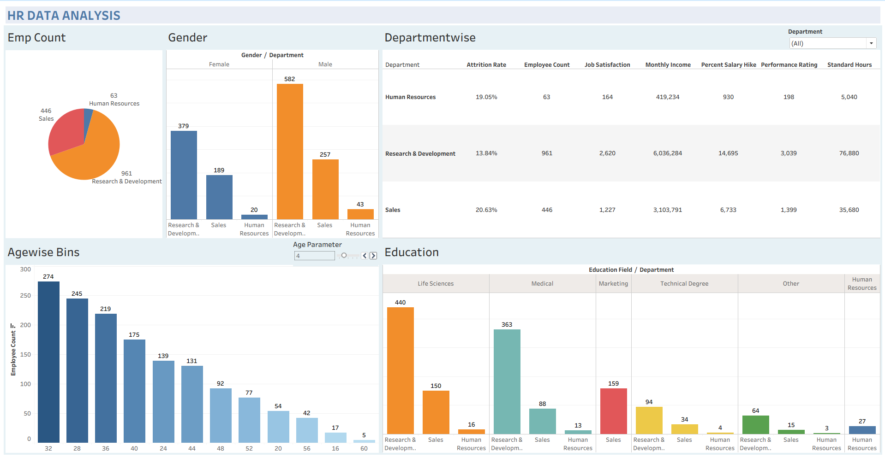

# 👩‍💼 HR Data Analysis Dashboard

## 🧠 Project Overview
This project analyzes employee data to identify attrition trends, workforce demographics, and departmental insights. The goal is to help HR teams make data-driven decisions to improve employee retention and satisfaction.

## 📁 Files Included
- `HR-Employee-Attrition.xlsx` → HR dataset used for analysis
- `HR DATA ANALYSIS.twbx` → Tableau Packaged Workbook (interactive dashboard)
- `dashboard.png` → Screenshot of the final HR dashboard

## 📸 Dashboard Preview

## 🎯 Key Insights
- Highest attrition is observed in the **Sales department (20.63%)**
- **Research & Development** has the largest workforce (961 employees)
- Employee distribution is highest between ages **28–35 years**
- Life Sciences and Medical are the top education backgrounds
- Monthly income varies significantly across departments

## 🛠️ Tools Used
- Tableau
- Microsoft Excel

## 🚀 Project Highlights
- Department-wise attrition analysis
- Employee age distribution bins
- Gender distribution across departments
- Education field vs department analysis

## 🌐 Live Interactive Dashboard
👉 [Click here to view the dashboard on Tableau Public](https://public.tableau.com/views/HRDATAANALYSIS_17560246134460/HRDATAANALYSIS?:language=en-US&publish=yes&:sid=&:redirect=auth&:display_count=n&:origin=viz_share_link)

## 👤 Author
**Rutikesh Pawar**  
[LinkedIn](https://www.linkedin.com/in/rutikeshpawar227) 
